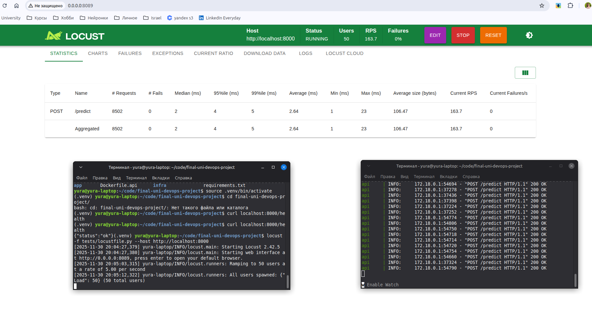
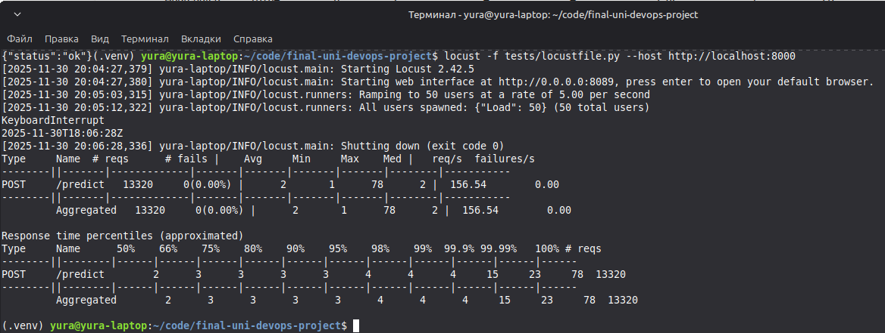
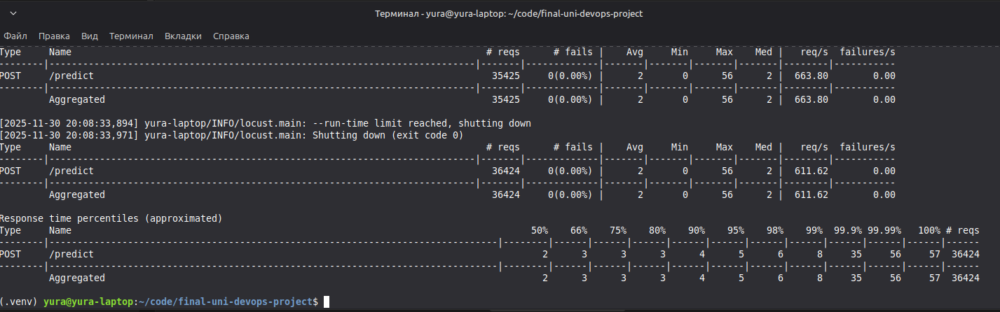

> 🇬🇧 **English** | 🇷🇺 [Русский](README_RU.md)

# Final report for the DevOps task

## 0. Link to the code

All code and folder structure live in the repo:

### https://github.com/yuramayer/final-uni-devops-project

Same repo keeps playbooks, locust csv, docker files and report.html – basically the whole service and used files

## 1. intro

I built a study service with a tiny ml model and some event logic
Idea was to show the whole path on a small thing: from thinking about API and service structure to infra setup, data drift checks and load tests.

while doing it I followed the criteria:

- API first style design,
- logical split into modules and micro services,
- use infra as code;
- have an ML block and data drift check via evidentlyai,
- track architecture choices as ADR;
- show load test results and conclusions.

I picked Readme as the report format, sits in the repo too!

## 2. general service overview

Service just does simple scoring on a small ML model.

Main flow:

- HTTP API takes a request with two numeric features feature_1 and feature_2,
- inside we call a small logistic model, it computes probability and returns binary prediction,
- then we build an event, add original features and some service info,
- events go into redis, a separate worker handles them async and writes jsonl log,
- collected logs later feed evidentlyai for drift check,
- HTTP API behavior under load I checked through locust.

## 3. API description (api first)

I designed it in api first style. First I set endpoints and data format. Only after that I wrote code for them.

### 3.1 endpoints

1. Health check

- URL: /health  
- Method: get   
- Input: none  
- Output: object like   
  `{ "status": "ok" }`  

fast check that HTTP service is alive and answering

2. Model prediction

- URL: /predict  
- Method: POST  
- Request format: JSON  

Sample request:

```JSON
{
  "feature_1": 1.5,
  "feature_2": -0.7
}
```

- Response format: JSON  

Sample response:

```json
{
  "request_id": "uuid-string",
  "probability": 0.73,
  "predicted_class": 1
}
```

request_id helps tracing requests.  
probability and predicted_class are results of the small ml scoring.

Input/output schemas live in app/schemas.py.  
I used pydantic classes: PredictRequest, PredictResponse and PredictionEvent.

### 3.2 API check

You can ping API with curl:

```bash
curl http://localhost:8000/health
```

```bash
curl -X POST "http://localhost:8000/predict" \
  -H "Content-Type: application/json" \
  -d "{\"feature_1\": 1.5, \"feature_2\": -0.7}"
```

Service structure and entry points are fixed and documented. overall pretty api first.

## 4. Modules and micro services split

Project sits in one repo. but logically it is split into small parts and micro services

### 4.1 Docker level

In docker-compose.yml there are three services:

- redis  
  - container with Redis 7
  - stores prediction events

- api  
  - container with FastAPI app
  - serves http api
  - gets REDIS URL from env
  - sends events to prediction_events channel

- worker  
  - container with faststream app
  - listens prediction_events in redis
  - writes events into data/logs/predictions.jsonl

So we get a simple event scheme:  
http layer lives alone, event handler works in own process. link goes through redis

### 4.2 Python modules level

Inside app we have:

- main.py  
  - entrypoint for fastapi http service
  - handles /health and /predict
  - sets redis connection in startup/shutdown events

- ml_model.py  
  - simple logistic model
  - predict_proba returns probability
  - predict_class gives binary class

- schemas.py  
  - pydantic models for requests, responses and events

- settings.py  
  - tiny wrapper around env vars
  - sets redis_url and app name

- events_worker.py  
  - worker on faststream
  - subscribes to prediction_events
  - writes events to predictions.jsonl

so micro service architecture: modules and roles are clear.

## 5. Architecture decisions (ADR)

To pick tech for event layer I wrote a small adr

### ADR 0001. Choosing library for Redis work

First I set the context: service must pass events from HTTP layer to worker, and as broker I went with Redis. On the course we saw two options, both ok.

Option one use asyncio redis directly. gives full command access, easy to work with lists/streams/channels. But you write more helper code, manage subscriptions manually, and can mess up async logic. For study project it feels heavy.

Option two use FastStream on top of RedisBroker. code is short, looks declarative, nice decorators for publishers/subscribers. But you add dependency and hide some low-level redis stuff behind framework. In prod maybe minus, here fine.

Because of that I picked **FastStream**. it gives clear worker, minimum boilerplate and readable architecture

## 6. Infra as code (IaC)

To deploy service I used docker compose plus ansible.  
This combo lets you raise app from scratch on clean machine and keep instructions as code.

### 6.1 Docker Compose

File `docker-compose.yml` describes three containers working together.  
Redis uses base image redis:7 and exposes 6379. it is just the broker

api container builds from Dockerfile.api. During build it installs deps from requirements.txt, copies app folder, then runs uvicorn with app.main:app. Connection to redis comes from env var redis_url, so config stays clean.

worker container builds similar but its entrypoint runs app.events_worker. It listens events and writes log.

So docker compose already gives minimal infra. With Docker available you just run  
`docker compose up -d`,  
and everything starts in the needed order.

### 6.2 Ansible

I added infra folder with tiny ansible configs. Inventory.ini describes local host:

- infra/inventory.ini  

contains local host description:

```ini
[local]
localhost ansible_connection=local
```

playbook.yml holds a simple playbook. It installs docker via package manager, copies project to server (I used /opt/devops-project), then inside that folder runs `docker compose up -d`. Playbook is short but shows how to automate deploy.

Run it like:

```bash
ansible-playbook infra/playbook.yml -i infra/inventory.ini
```

As result service can start even on fully clean machine with only ansible installed. Need only wifi so docker can install :)

> btw for final assignment I installed Linux Mint instead of windows 10 on my laptop. no regrets! :)

## 7. ML part and data drift check with evidently AI

### 7.1 ML model

File app/ml_model.py has SimpleLogisticModel.  
It uses two features — feature_1 and feature_2 — and fixed coefficients.  

> main goal not best model quality, so model is very simple. Need just to show ML part exists as own block and integrates into our mini architecture

Model has two main methods
- predict_proba calculates target probability 
- predict_class turns it into binary answer with 0.5 threshold

### 7.2 Prediction logging

Worker in app/events_worker.py listens prediction_events channel.  
Each message is PredictionEvent. It includes request_id, features dict, probability, predicted_class and timestamp

Worker writes all events into `data/logs/predictions.jsonl`. jsonl is handy because each line is separate JSON. easy to read later with pandas, exactly what we need for analysis

### 7.3 Drift analysis script

For drift I wrote script analysis/run_evidently.py.  
It reads `predictions.jsonl` into pandas DataFrame, then expands features dict into normal columns feature_1 and feature_2. After that it builds two samples: reference — first N rows, current — last N rows. In work I used 200 rows each, but checks df length to avoid overflow.

Then I set column mapping: feature_1 and feature_2 go to numerical_features, probability goes as prediction. Based on that we create report via DataDriftPreset, save it into report.html

Run script simply:

```bash
python analysis/run_evidently.py
```

### 7.4 Reading results

Evidently showed no strong drift.  
So distributions in reference and current almost same, probability distribution stable too.

Means load test and time changes did not change data profile. Service gets roughly same values. HTTP layer, redis and worker cooperate ok.

In wider view, no drift means stable input flow. In real system we would run this check regularly to catch issues in data sources.

---

## 8. Load testing with Locust

### 8.1 Load scenario

To see how service behaves under load I used locust.  
Folder tests has `tests/locustfile.py` with scenario.  
There class PredictUser extends FastHttpUser and sends requests to /predict.  
feature_1 and feature_2 values are random in small range, between requests user waits using wait_time.

Payload looks like:

```json
{
  "feature_1": random number -5..5,
  "feature_2": random number -5..5
}
```

### 8.2 Running Locust

Before load test the api service must run via docker compose.  
After that run locust in two ways.

First - via web ui.  
Command:

```bash
locust -f tests/locustfile.py --host http://localhost:8000
```

Locust opens page on 8089, in browser you can set users, spawn rate and watch rps/latency charts.



Second way — headless for reports/logs.  
Command:

```bash
locust -f tests/locustfile.py \
  --host http://localhost:8000 \
  --headless \
  -u 200 \
  -r 20 \
  -t 60s \
  --csv=locust_run
```



After run folder locust_data gets metric files:  
locust_run_stats.csv, locust_run_stats_history.csv, locust_run_failures.csv and locust_run_exceptions.csv.  
They show total requests, latency distribution and possible errors.



They live in `locust_data/`

### 8.3 Observations

During tests service behaved stable.  
Request flow to `/predict` was handled without drops, response time stayed ok, http layer kept returning valid answers. When increasing virtual users the load grows, but behavior stays predictable.

If you look at locust results together with evidently report you get a full picture:  
service handles stated load, api + redis + worker stay together, and data stored in predictions.jsonl during test looks normal and ready for analysis.

So the load testing criterion is closed — we have logs, observations, explanation.

## 9. Deployment and reproducibility

Here I describe how to start service on new machine.  
Idea: you can run project manually via docker compose or fully automated through ansible in infra/.

Simplest path — local run.  
First clone repo:

`git clone git@github.com:yuramayer/final-uni-devops-project.git`

Then install docker and docker compose, start services:

```bash
cd final-uni-devops-project
docker compose up -d
```

Then check api works:

`curl http://localhost:8000/health`

If ok, `/predict` also available, and service starts writing events into redis and logs.

For load test run locust in any mode (web or headless).  
When logs accumulate, run drift analysis:

`python analysis/run_evidently.py`

Script creates `report.html`, open it in browser. It is also stored in repo.

Need to mention ansible in infra/.  
There is `inventory.ini` with local host, and simple `playbook.yml`.  
Playbook installs docker, copies project to server (say `/opt/devops-project`) and inside runs docker compose up -d.  
So with remote machine and ssh access, deploy looks like:

```bash
ansible-playbook infra/playbook.yml -i infra/inventory.ini
```

This way you raise whole infra from zero with single command 🙂  
Target host needs nothing preinstalled, ansible will install docker and start service.

Overall project can be deployed manually or fully automated.

## 10. Conclusion

In the end we have an autonomous service with a full devops flow.  
Service has designed http api, split into parts — api, worker, redis; starts via docker compose.  
Infra is code, ansible in infra/ lets you deploy on clean machine with no manual steps.

There is ML part that makes predictions, and worker that collects events and writes jsonl.  
Those logs feed drift analysis via evidently, producing HTML report.

Also the service passed load testing in locust, giving understanding of behavior under growing request count.

thanks for the nice assignment!
